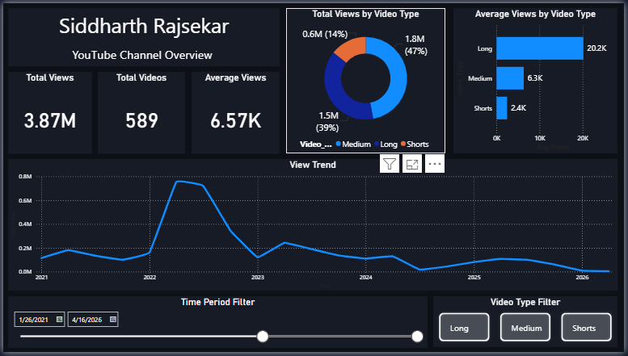
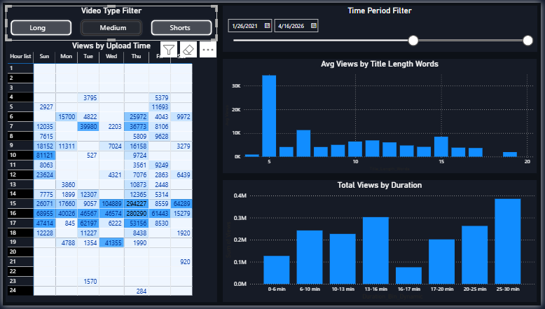

# YouTube Channel Growth Analysis
**Tools:** Python (Pandas, Seaborn, Matplotlib, ReportLab) | Power BI | DAX

## Project Overview
End-to-end growth analysis of a YouTube channel with 925 videos and 7.3M total views 
(Dec 2012 – Apr 2026). Identified content strategy gaps and optimal upload timing 
using Python and visualized findings in an interactive Power BI dashboard.

## Key Findings
- Long-form videos (16% of uploads) generate 75% more avg views than Shorts
- Tuesday 11am is the highest-performing upload slot — 126K avg views vs 7.9K channel mean
- Title sweet spot: 5–12 words + exclamation mark; question marks reduce views by 66%
- Duration sweet spots: Long = 40–55 min | Medium = 16–17 min | Shorts = under 57 sec

## Dashboard Pages
| Page | Content |
|------|---------|
| Page 1 | Channel Overview — KPIs, view trend, video type breakdown |
| Page 2 | Timing Heatmap — Hour × Day matrix, duration analysis, title length |
| Page 3 | Recommendations — Actionable growth insights |

## Files
| File | Description |
|------|-------------|
| `SR_YouTube_Dashboard.pbix` | Power BI dashboard file |
| `SR_YouTube_Growth_Report.pdf` | Automated PDF analysis report |
| `growth_factor_analysis.html` | Python EDA notebook |
| `screenshots/` | Dashboard preview images |

## Dashboard Preview

## How to Run
1. Open `.pbix` file in Power BI Desktop (free download from Microsoft)
2. Data is pre-loaded — no additional setup needed
3. Use Video Type Filter buttons and Time Period slicer to explore
